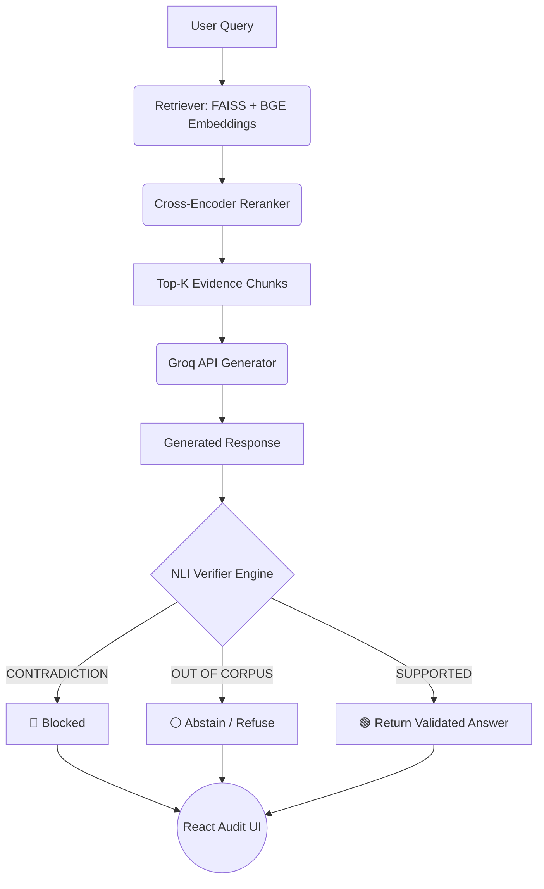
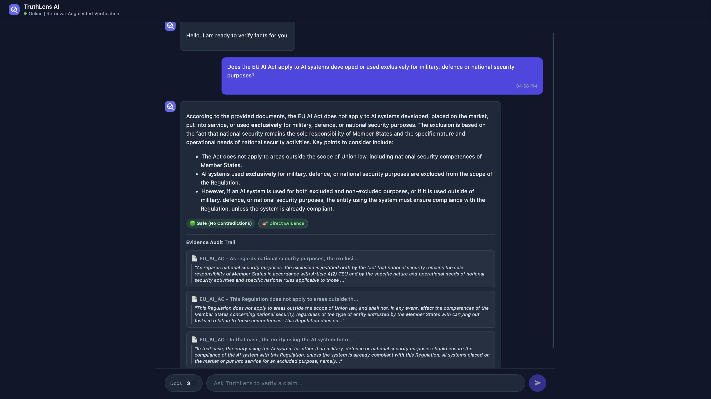
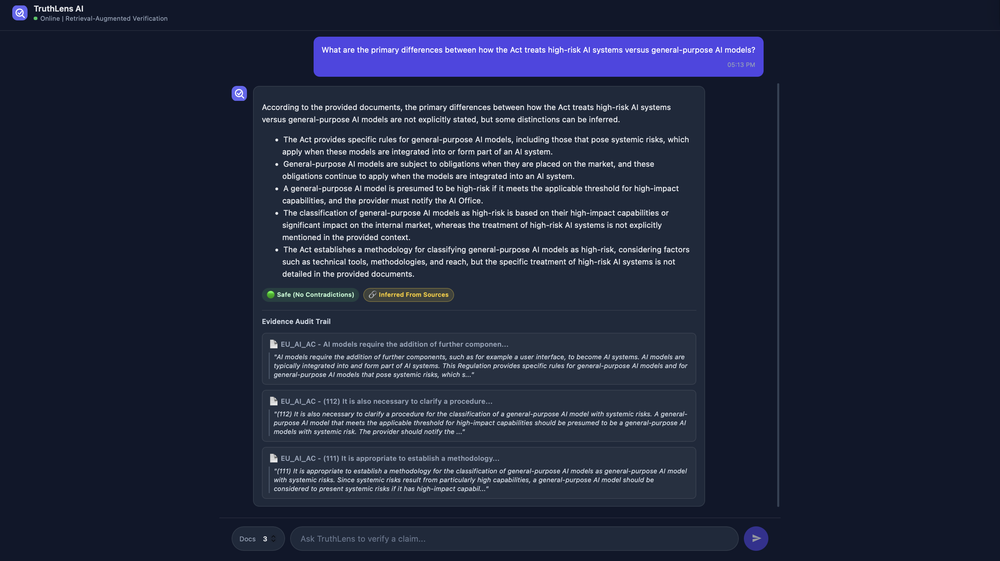
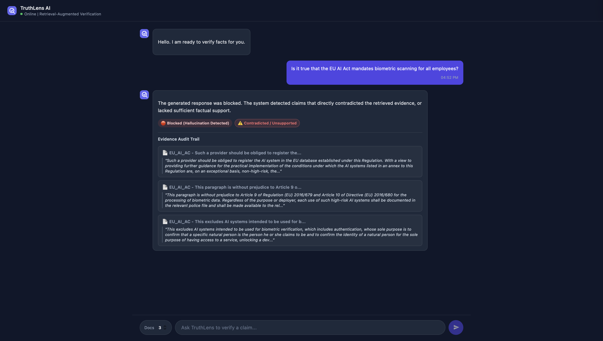
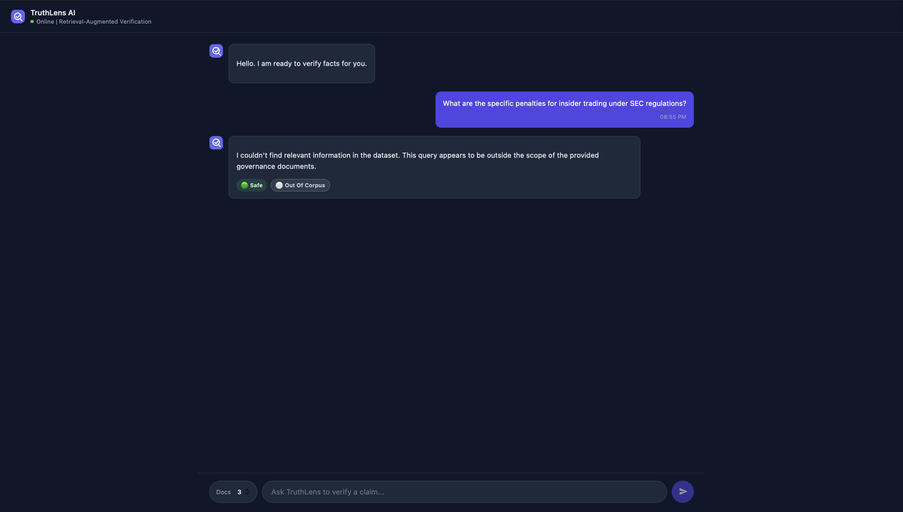

# TruthLens: Enterprise-Grade Retrieval-Augmented Verification (RAG+V)

TruthLens is an advanced Retrieval-Augmented Verification (RAG+V) system designed to reduce hallucinations and enforce strict epistemic boundaries in Large Language Model (LLM) pipelines.

TruthLens was developed to address a critical limitation of modern LLM systems: the tendency to generate confident answers even when supporting evidence is weak, missing, or entirely outside the system's knowledge boundary.

Unlike standard Retrieval-Augmented Generation (RAG) architectures that trust the generator layer, TruthLens treats generated answers as unverified hypotheses. Responses are evaluated against retrieved evidence using an independent Natural Language Inference (NLI) verification engine before being returned to the user.

---

## 🎯 Engineering Motivation

Modern LLM applications are increasingly deployed in domains where incorrect information can have serious consequences, including:
- Regulatory compliance
- Governance and risk management
- Healthcare
- Legal research
- Enterprise knowledge systems

While Retrieval-Augmented Generation (RAG) improves factual grounding through document retrieval, most implementations still trust the generated response without independently validating it.

TruthLens explores a Retrieval-Augmented Verification (RAG+V) architecture, where generation is followed by an evidence-verification stage that evaluates whether the response is actually supported by retrieved documents.

---

## 🎯 Domain Scope & Evaluation Corpus

TruthLens is intentionally designed as a domain-specific verification system rather than a general-purpose chatbot. 

The current evaluation corpus focuses on international AI governance, risk management, and regulatory compliance, specifically featuring:
- The European Union Artificial Intelligence Act (EU AI Act)
- Regulatory penalty frameworks and compliance mandates
- Supporting AI governance reference documents

This focused design improves retrieval precision, reduces semantic drift, and lowers hallucination risk compared to unrestricted open-domain systems.

---

## 🏗️ Core Architectural Features

### 1. Natural Language Inference (NLI) Verification Engine
- **Semantic Cross-Examination:** Evaluates generated responses against retrieved evidence.
- **Cross-Encoder Alignment:** Uses an independent NLI model to classify relationships between generated content and source documents as:
  - `ENTAILMENT`
  - `NEUTRAL`
  - `CONTRADICTION`

### 2. Four-Level Evidence Taxonomy
TruthLens moves beyond simplistic "correct/incorrect" classifications by implementing a structured evidence framework:

- 🎯 **Direct Evidence:** Explicit textual support exists within the retrieved corpus.
- 🔗 **Inferred From Sources:** The response represents valid reasoning or synthesis derived from retrieved evidence.
- ⚠️ **Contradicted / Unsupported:** Evidence conflicts with or fails to support the generated response.
- ⚪ **Out Of Corpus:** The query falls outside the active knowledge domain and triggers a controlled refusal.

### 3. Epistemic Humility (Corpus Boundary Enforcement)
- Semantic topic matching
- Retrieval boundary validation
- Controlled abstention behavior

Rather than generating speculative answers, TruthLens explicitly acknowledges when information falls outside the available corpus.

### 4. Deterministic Audit Trail UI
The React-based audit interface provides:
- Safety status indicators
- Evidence classifications
- Source transparency
- Human-in-the-loop verification support

## 🧩 Architecture Flow

## 🧩 Architecture Flow


---

## 📸 System Demonstration

### 🎯 Direct Evidence
*Example of a response directly supported by retrieved evidence.*


### 🔗 Inferred From Sources
*Example of multi-document reasoning and synthesized knowledge.*


### ⚠️ Contradiction Handling (Hallucination Mitigation)
*Example of the NLI engine catching a hallucination and blocking the response.*


### ⚪ Out Of Corpus
*Example demonstrating corpus-boundary enforcement and graceful refusal.*


---

## 🛠️ Technology Stack

### Backend & Verification Engine
- **FastAPI & Python**
- **FAISS Vector Search**
- **SentenceTransformers (BGE-Large Embeddings)**
- **PyTorch (CPU-Optimized)**
- **Cross-Encoder Reranking (NLI Verification Layer)**

### Frontend
- **React & Vite**
- **TailwindCSS**
- **Markdown Rendering**
- **Evidence Classification UI**

### LLM Layer
- **Groq API**
- **Meta Llama 3 (llama-3.3-70b-versatile)**
- **Retrieval-Augmented Generation (RAG)**

---

## 🔍 Example Queries

**Direct Retrieval**
> What are the specific penalties for non-compliance with the EU AI Act?

**Cross-Document Reasoning**
> If a provider is an SME, how does that affect the administrative fines imposed upon them?

**Corpus Boundary Enforcement**
> What are the specific penalties for insider trading under SEC regulations?

**Hallucination Detection**
> Is it true that the EU AI Act mandates biometric scanning for all employees?

---

## 🚀 Validation Scenarios

### Test A: Direct & Synthesized Knowledge
**Expected Outcome:**
- Evidence retrieved
- Response generated
- Verification completed
- `Direct Evidence` or `Inferred From Sources` classification

### Test B: Corpus Boundary Enforcement
**Expected Outcome:**
- Corpus mismatch detected
- Retrieval boundary enforced
- Controlled abstention returned (`Out Of Corpus`)

### Test C: Contradiction Handling
**Expected Outcome:**
- Contradiction signals detected
- Response blocked
- Hallucination mitigation triggered

---

## 🔮 Current Limitations & Future Work

Current verification is performed at the generated-response level. 

Future iterations will introduce **claim-level verification**, where generated responses are decomposed into individual factual claims and independently validated against retrieved evidence.

### Planned Enhancements
- Claim-level NLI verification
- Evidence-to-source page mapping
- Metadata-aware retrieval
- Multi-tenant access control
- Confidence stratification
- Enhanced multi-document reasoning

---

## 💻 Developer Onboarding & Local Setup

TruthLens is engineered to be cross-platform (macOS, Linux, and Windows). Pathing is handled dynamically using Python's `pathlib`.

### Prerequisites
Before running the application, you must configure your environment variables. Create a `.env` file in the `backend` directory and add your API keys:
```env
GROQ_API_KEY=your_api_key_here
```

### Option A: Docker Deployment (Recommended)
```bash
docker-compose up --build 
```
- **Backend API:** `http://localhost:8000`
- **Frontend UI:** `http://localhost:5173`

### Option B: Manual Local Setup

#### 1. Backend Initialization
```bash
cd backend 
```

Create and activate a virtual environment:

**macOS / Linux**
```bash
python3 -m venv venv
source venv/bin/activate 
```

**Windows**
```bash
python -m venv venv
.\venv\Scripts\activate 
```

Install dependencies and start the server:
```bash
pip install -r requirements.txt 
uvicorn app.main:app --reload --port 8000
```

#### 2. Frontend Initialization
Open a second, separate terminal window:
```bash
cd frontend
npm install
npm run dev
```