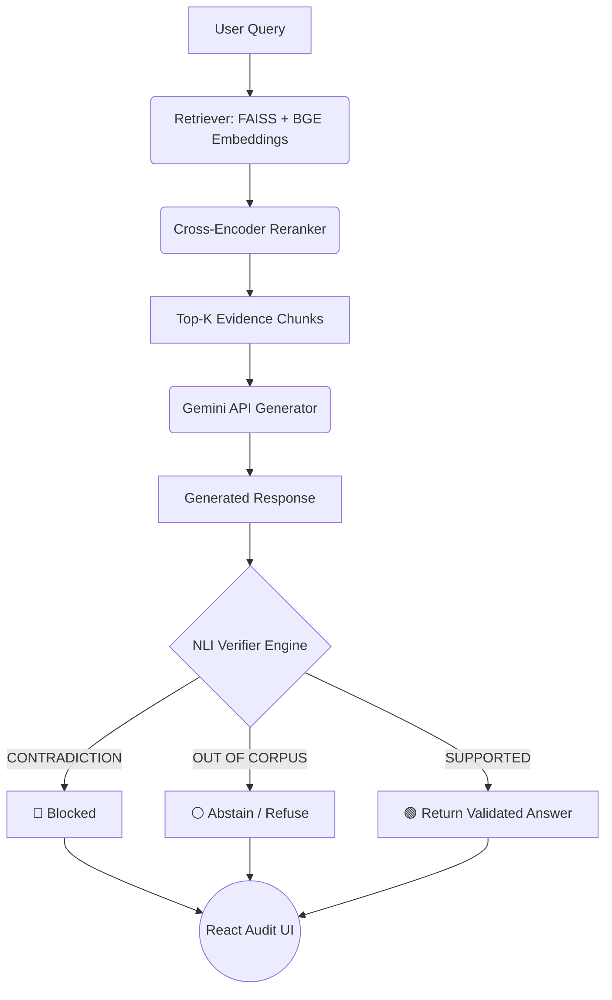

# TruthLens: Enterprise-Grade Retrieval-Augmented Verification (RAG+V)

> **Research Publication Impact:** This architecture expands on the foundational real-time system paradigms published in my peer-reviewed paper: *"Development of a Multi-Module AI Infotainment System for Real-Time Assistance and Control"* (International Journal, Issue - May 2026).

TruthLens is an advanced RAG Guardrail and factual verification system designed to reduce hallucinations and enforce strict epistemic boundaries in Large Language Model (LLM) pipelines. 

**TruthLens was developed to address a critical limitation of modern LLM systems: the tendency to generate confident answers even when supporting evidence is weak, missing, or entirely outside the system's knowledge boundary.**

**Unlike standard RAG architectures that blindly trust the generator layer, TruthLens treats generated answers as unverified hypotheses.** It evaluates generations against retrieved documents using an independent **Natural Language Inference (NLI)** verification engine before passing responses to the application layer.

---

## 🎯 Domain Scope & Evaluation Corpus

TruthLens is intentionally designed as a domain-specific Retrieval-Augmented Verification system rather than a general-purpose chatbot. The current evaluation corpus focuses on AI governance, trustworthiness, risk management, and regulatory compliance, including:

* NIST AI Risk Management Framework (AI RMF 1.0)
* NIST Generative AI Profile (AI 600-1)
* Supporting AI governance and regulatory reference documents

**This domain-focused design enables stronger retrieval precision, stricter verification, and reduced hallucination risk compared to unrestricted open-domain systems.**

---

## 🏗️ Core Architectural Features

### 1. Natural Language Inference (NLI) Verifier Engine
* **Semantic Cross-Examination:** Evaluates the LLM's generated response against retrieved reference documents.
* **Cross-Encoder Alignment:** Uses an external Cross-Encoder NLI model to assign classification scores for `ENTAILMENT`, `NEUTRAL`, and `CONTRADICTION` against the source text.

### 2. Four-Level Stratified Evidence Taxonomy
TruthLens moves away from simplistic binary "correct/incorrect" flags, implementing an enterprise-grade taxonomy that classifies the exact nature of the response generation:
* 🎯 **Direct Evidence:** Explicit, verbatim, or near-verbatim textual backing within the dataset.
* 🔗 **Inferred From Sources:** The answer is synthetically accurate, representing a valid logical abstraction or cross-document reasoning.
* ⚠️ **Contradicted / Unsupported:** Conflicting facts or unbacked claims detected; automatically triggers a secure system fallback.
* ⚪ **Out Of Corpus:** The engine detects that the query targets concepts completely outside the active knowledge domain, triggering a graceful refusal.

### 3. Epistemic Humility (Corpus Boundary Enforcement)
* **Corpus Boundary Enforcement:** Prevents out-of-domain hallucinations through semantic topic matching and retrieval boundary checks. 
* **Automatic Fallback:** Automatically abstains when user queries fall outside the active knowledge domain, dynamically dropping irrelevant source tracking.

### 4. Deterministic Audit Trail UI
* A responsive, scannable React frontend that visualizes safety badges (`Safe (Boundary Enforced)`, `Safe (No Contradictions)`, `Blocked`).
* Renders exact reference documentation snippets to ensure human-in-the-loop auditability.

---

### Architecture Flow



## 🛠️ Tech Stack

**Backend & Verification Engine:**
* FastAPI (Python)
* FAISS Vector Search
* SentenceTransformers & BGE-Large Embeddings
* Cross-Encoder Reranking
* NLI Verification Layer

**Frontend UI:**
* React (JavaScript) & TailwindCSS
* Markdown Rendering
* Evidence Classification UI

**LLM Core:**
* Gemini API
* Retrieval-Augmented Generation (RAG) Pipeline

---

## 🔍 Example Queries

* **Direct Retrieval:** *"What are the seven trustworthiness characteristics of AI systems?"*
* **Cross-Document Reasoning:** *"If an AI system is secure but prone to confabulation, would NIST consider it trustworthy?"*
* **Risk Analysis:** *"How does NIST define data poisoning?"*
* **Corpus Boundary Enforcement:** *"What are the SEC compliance regulations for using AI in cryptocurrency trading?"*
* **Hallucination Detection:** *"According to the documents, is it acceptable for an AI system to bypass safety protocols to improve performance?"*

---

## 🚀 Rapid Verification Benchmarks (The UI Test)

The system routing logic handles three distinct epistemic states:

### Test A: Direct & Synthesized Knowledge (NIST Frameworks)
* **System Action:** Retrieves documentation, evaluates alignment score thresholds, and outputs a `🟢 Safe` + `🔗 Inferred From Sources` or `🎯 Direct Evidence` token payload.

### Test B: Strict Boundary Enforcement (Off-Topic Mitigation)
* **System Action:** Intercepts out-of-corpus parameters, flags `final_abstain = True`, and updates the response layout to `⚪ Out Of Corpus` with clean audit-trail dismissal.

### Test C: Hallucination & Contradiction Blocking
* **System Action:** NLI Verifier evaluates the generated response against retrieved evidence, detects a logical `CONTRADICTION` against the retrieved NIST guidelines, triggers the secure fallback protocol, and renders a `🛑 Blocked (Hallucination Detected)` state.

---

## 🔮 Current Limitations & Future Work

Current verification is performed at the generated-response level. Future iterations will introduce claim-level verification, where individual factual statements are extracted and independently validated against retrieved evidence.

**Additional roadmap items include:**
* Claim-level NLI verification
* Evidence-to-source page mapping
* Metadata-aware retrieval
* Multi-tenant access control for enterprise deployments
* Confidence stratification between direct evidence and inferred reasoning

---

## 💻 Developer Onboarding & Local Setup

TruthLens is engineered to be fully cross-platform (macOS/Linux/Windows). Pathing is handled dynamically via Python's `pathlib` to ensure smooth execution across diverse OS environments.

### Option A: The Zero-Config Docker Setup (Recommended)
For immediate, environment-agnostic deployment, ensure Docker Desktop is running and execute:
```bash
docker-compose up --build
```
*(The backend will be available at `localhost:8000` and the frontend at `localhost:3000`.)*

### Option B: Manual Local Setup

**1. Initialize the AI Backend (FastAPI)**
```bash
cd truthlens/backend
```

**Create and activate the virtual environment:**
* **Mac/Linux:** `python3 -m venv venv && source venv/bin/activate`
* **Windows:** `python -m venv venv && .\venv\Scripts\activate`
*(Windows Note: If PowerShell restricts execution, run `Set-ExecutionPolicy Unrestricted -Scope CurrentUser` as Administrator).*

**Install dependencies:**
```bash
pip install -r requirements.txt
```
*(Windows FAISS Note: If `faiss-cpu` fails to compile via pip, use Conda: `conda install -c pytorch faiss-cpu`).*

**Start the API:**
```bash
uvicorn app.main:app --reload
```

**2. Initialize the Audit UI (React)**
Open a second terminal window:
```bash
cd truthlens/frontend
npm install
npm run dev
```
